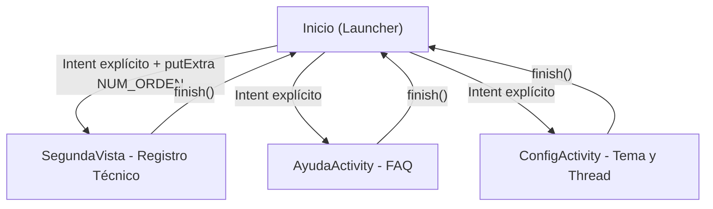

# 🛠️ Asistente de Terreno — Prototipo 2

Aplicación Android nativa (Java) para técnicos de terreno: registro de órdenes de trabajo, captura de evidencia fotográfica, acceso rápido a mapas, llamadas, correo y ajustes de red, control de linterna y sincronización simulada con un servidor.

---

## 📋 Ficha técnica

| Elemento | Valor |
|---|---|
| Lenguaje | Java 11 |
| Paquete | `com.st.asistenteterreno` |
| Plantilla | Empty Views Activity |
| Min SDK | 24 (Android 7.0) |
| Compile / Target SDK | 34 (Android 14) |
| Build | Gradle Kotlin DSL (`build.gradle.kts`) |
| Rama de trabajo | `feature/intents` |

---

## 🧭 Arquitectura de pantallas



| Activity | Layout | Responsabilidad |
|---|---|---|
| `Inicio` | `activity_inicio.xml` | Menú principal, linterna, carga del tema guardado |
| `SegundaVista` | `activity_segunda_vista.xml` | Recibe la OT, cámara y 5 intents implícitos |
| `AyudaActivity` | `activity_ayuda.xml` | Preguntas frecuentes y soporte |
| `ConfigActivity` | `activity_config.xml` | Modo oscuro/claro y sincronización con `Thread` |

---

## ✅ Cumplimiento de la rúbrica

### 1. Intents explícitos (3)
- `Inicio → SegundaVista` con `putExtra("NUM_ORDEN", "OT-8492: Mantenimiento Preventivo")`, leído con `getStringExtra` y mostrado en `tvDetalleOrden`.
- `Inicio → AyudaActivity` con retorno mediante `finish()`.
- `Inicio → ConfigActivity` con retorno mediante `finish()`.

### 2. Intents implícitos (5, en `SegundaVista`)
| Función | Acción | Dato |
|---|---|---|
| 📸 Cámara | `MediaStore.ACTION_IMAGE_CAPTURE` | `registerForActivityResult` → `Bitmap` en `ImageView` |
| 🗺️ Mapa | `Intent.ACTION_VIEW` | `geo:0,0?q=Santiago, Chile` |
| 📞 Llamada | `Intent.ACTION_DIAL` | `tel:+56912345678` |
| ✉️ Correo | `Intent.ACTION_SENDTO` | `mailto:soporte@terreno.cl` + `EXTRA_SUBJECT` / `EXTRA_TEXT` |
| 📶 Wi-Fi | `Settings.ACTION_WIFI_SETTINGS` | — |

### 3. Control de hardware
Linterna con `CameraManager.setTorchMode(idCamara, estado)`. Verifica `FEATURE_CAMERA_FLASH` y se apaga automáticamente en `onStop()`.

### 4. Concurrencia
`ConfigActivity` lanza un `Thread` secundario que simula 3 etapas de sincronización con `Thread.sleep()` y actualiza la interfaz con `runOnUiThread()` (estado, detalle, `ProgressBar`).

### 5. Manejo de errores y validaciones
- `try-catch` con `ActivityNotFoundException` en todos los intents implícitos.
- Validación de `RESULT_OK`, `getData() != null`, `getExtras() != null` y `Bitmap != null`.
- `hasExtra("NUM_ORDEN")` y verificación de cadena no vacía.
- Captura de `InterruptedException` en el hilo.

### 6. Permisos en tiempo de ejecución
`CAMERA` es un permiso peligroso: se solicita con `ActivityResultContracts.RequestPermission` antes de abrir la cámara o encender la linterna.

---

## 🌗 Modo oscuro / claro
- `SwitchMaterial` en `ConfigActivity` → `AppCompatDelegate.setDefaultNightMode(...)`.
- Preferencia persistida en `SharedPreferences` (`AjustesApp` / `modo_oscuro`) y aplicada en `Inicio` al arrancar.
- Colores semánticos en `values/colors.xml` y `values-night/colors.xml`: `btn_background`, `btn_text`, `text_secondary`.

---

## 🔐 AndroidManifest
- Permisos: `CAMERA`, `ACCESS_FINE_LOCATION`, `ACCESS_COARSE_LOCATION`.
- `uses-feature` de cámara y flash como `required="false"`.
- `<queries>` para cámara, `tel`, `mailto` y `geo` (visibilidad de paquetes en Android 11+).
- `Inicio` es la actividad `LAUNCHER` (`exported="true"`).

---

## 📁 Estructura principal

```
app/src/main/
├── AndroidManifest.xml
├── java/com/st/asistenteterreno/
│   ├── Inicio.java
│   ├── SegundaVista.java
│   ├── AyudaActivity.java
│   └── ConfigActivity.java
└── res/
    ├── layout/            (4 layouts)
    ├── mipmap-anydpi-v26/ (íconos adaptativos, API 26+)
    ├── values/            (colors, strings, themes)
    └── values-night/      (colors, themes del modo oscuro)
```

---

## ▶️ Compilar y ejecutar

```powershell
.\gradlew assembleDebug        # genera app/build/outputs/apk/debug/app-debug.apk
.\gradlew installDebug         # instala en el dispositivo conectado
```

### Teléfono físico no detectado
1. Ajustes → Acerca del teléfono → tocar 7 veces **Número de compilación**.
2. Opciones de desarrollador → activar **Depuración por USB**.
3. Usar un cable de datos y modo **Transferencia de archivos**.
4. Aceptar el diálogo de huella RSA (“Permitir siempre”).
5. Instalar **Google USB Driver** (SDK Manager → SDK Tools) o el driver del fabricante.
6. Verificar:
   ```powershell
   & "$env:LOCALAPPDATA\Android\Sdk\platform-tools\adb.exe" devices -l
   ```

---

## 🌿 Flujo Git

```powershell
git checkout feature/intents
git status                     # revisar antes de cada commit
git add <archivos de una sola funcionalidad>
git commit -m "feat(alcance): descripción"
git log --oneline --graph -n 10
```

Convención: `feat`, `fix`, `style`, `docs`, `chore`.

---

## 👤 Autor
Proyecto académico — Asistente de Terreno, Prototipo 2.
